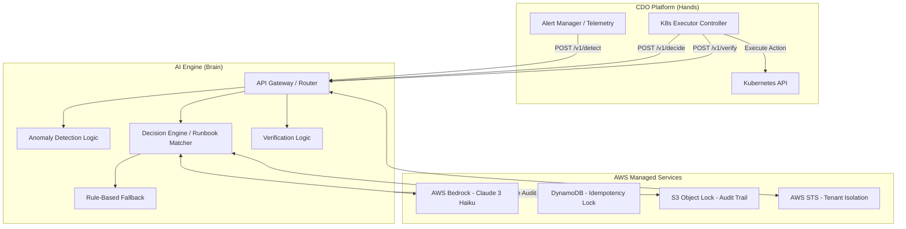

# Solution Design - Generic Multi-Tenant Self-Heal Platform (AIOps TF3)

Doc owner: AI Team
Status: Final
Word count: 1250 words

## 1. High-level architecture

Cấu trúc tổng thể của hệ thống tự chữa lành tuân theo nguyên tắc phân tách trách nhiệm (Brain vs Hands), trong đó AI Engine đóng vai trò "Brain" phân tích và ra quyết định, còn CDO Platform đóng vai trò "Hands" thực thi.

## 2. Component breakdown

| Component | Responsibility | Tech choice | Why |
|---|---|---|---|
| **API Gateway / Router** | Tiếp nhận request từ CDO Platform, định tuyến, phân lập tenant | AWS API Gateway hoặc FastAPI (Container) | Cung cấp điểm truy cập duy nhất, dễ dàng tích hợp xác thực và rate-limit. |
| **Tenant Isolation Layer** | Đảm bảo cách ly dữ liệu giữa các tenant | AWS STS (AssumeRole) | Sử dụng ABAC với Session Tags giúp ngăn chặn rò rỉ dữ liệu chéo từ cấp độ IAM, thay vì chỉ dựa vào logic code. |
| **Decision Engine** | Đọc hiểu telemetry, đối chiếu runbook và sinh ra JSON kế hoạch hành động | AWS Bedrock (Claude 3 Haiku) | Độ trễ cực thấp (p99 < 3s), chi phí token rẻ, hỗ trợ tốt tác vụ đọc logs và format output JSON. |
| **Fallback System** | Hệ thống dự phòng tĩnh khi LLM sập hoặc vượt quá cost cap | Rule-based Python Scripts | Độ trễ < 500ms, đảm bảo tính sẵn sàng cao (High Availability) cho nền tảng. |
| **Idempotency Lock** | Khóa chống trùng lặp xử lý hành động sửa đổi hạ tầng | Amazon DynamoDB | Hỗ trợ conditional writes nguyên tử (atomic), độ trễ thấp (single-digit ms) và TTL tự động dọn dẹp. |
| **Audit Trail Storage** | Lưu vết toàn bộ quyết định, chống giả mạo (tamper-evident) | Amazon S3 Object Lock | Đáp ứng tiêu chuẩn WORM (Write Once Read Many) của SOC2 Type II compliance. |

## 3. Data flow

Quy trình tự chữa lành tiêu chuẩn diễn ra qua 3 bước (endpoints):

1. **Phát hiện (POST /v1/detect)**
   - CDO Platform đẩy dữ liệu telemetry (metrics, logs, events) vào endpoint.
   - AI Engine trích xuất thông tin, đánh giá có lỗi hay không (Anomaly = True/False) thông qua rule-based hoặc LLM nhanh.
   - Output: `DetectResponse` chứa thông tin tóm tắt lỗi (`anomaly_context`).

2. **Lập kế hoạch (POST /v1/decide)**
   - CDO Platform gửi `anomaly_context` kèm theo `Idempotency-Key` để yêu cầu kế hoạch sửa đổi.
   - Hệ thống cố gắng ghi `Idempotency-Key` vào DynamoDB (Conditional Write). Nếu ghi lỗi (đã tồn tại), trả về `409 Conflict`.
   - AI Engine giả lập quyền của Tenant qua AWS STS.
   - Kiểm tra hạn mức chi phí LLM. Nếu vượt ngưỡng hoặc Bedrock lỗi, chuyển sang Fallback System.
   - Gửi prompt chứa ngữ cảnh lỗi và thư viện Runbooks tới Claude 3 Haiku để lựa chọn giải pháp tối ưu.
   - Claude 3 trả về danh sách các bước hành động (`action_plan`), cấu hình vùng ảnh hưởng (`blast_radius_config`) và chính sách xác thực (`verify_policy`).
   - Ghi bản snapshot của kế hoạch vào S3 Object Lock làm Audit Trail.
   - Output: `DecideResponse` chứa kế hoạch hành động định dạng JSON.

3. **Xác thực (POST /v1/verify)**
   - Sau khi CDO Controller thực thi xong `action_plan` và chờ qua khoảng thời gian `window_seconds`, nó gửi dữ liệu telemetry mới nhất lên AI Engine.
   - AI Engine đối chiếu trạng thái hiện tại với `success_conditions`.
   - Output: Trả về trạng thái `SUCCESS`, `REGRESSION` (kèm theo next_action là ROLLBACK) hoặc `ESCALATE` (nếu không thể giải quyết).

## 4. Alternatives considered (KEY section)

### A. Chọn kiểu kiến trúc cho AI Engine
- **Option A (AI trực tiếp quản lý K8s API)**: AI Engine được cấp quyền `kubeconfig` để tự đọc logs và tự apply manifests.
  - *Pros*: Pipeline ngắn gọn, ít endpoint trung gian.
  - *Cons*: Bề mặt tấn công (Attack Surface) quá lớn, rủi ro xóa nhầm namespace production, vi phạm SOC2 least privilege.
- **Option B (AI Engine chỉ là API tư vấn)**: CDO Platform đẩy data lên, AI trả JSON về, CDO tự thực thi.
  - *Pros*: An toàn tuyệt đối, phân tách rõ ràng blast radius. Phù hợp hoàn hảo với mô hình multi-tenant.
  - *Cons*: Contract giao tiếp phức tạp, yêu cầu CDO phải xây dựng executor controller.
- **Chosen: Option B**.
  - *Reason*: Tuân thủ SOC2 và nguyên tắc an toàn cho Production K8s. (Ref: ADR-001)

### B. Chọn công nghệ chống trùng lặp (Idempotency)
- **Option A (Redis Cache)**: Dùng Redis `SETNX`.
  - *Pros*: Rất nhanh.
  - *Cons*: Cache eviction có thể vô tình xóa key đang cần lock, Redis cần maintain cluster HA.
- **Option B (DynamoDB Conditional Write)**: Dùng `PutItem` với `attribute_not_exists()`.
  - *Pros*: Không cần maintain server (Serverless), ghi nguyên tử (atomic write), cấu hình được TTL tự động xóa.
  - *Cons*: Chậm hơn Redis khoảng vài ms (nhưng hoàn toàn chấp nhận được).
- **Chosen: Option B**.
  - *Reason*: Tính bền vững dữ liệu và không phát sinh chi phí duy trì Redis Cluster. (Ref: ADR-005)

### C. Chọn LLM Foundation Model
- **Option A (Claude 3.5 Sonnet)**:
  - *Pros*: Suy luận cực thông minh.
  - *Cons*: Độ trễ cao (4-8s) và giá quá đắt.
- **Option B (Claude 3 Haiku)**:
  - *Pros*: Nhanh (p99 < 3s), siêu rẻ, đủ sức map rule và JSON schema.
  - *Cons*: Không thể giải quyết deep chain-of-thought quá sâu.
- **Chosen: Option B**.
  - *Reason*: Tối ưu hóa RTO (Recovery Time Objective) và Cost-per-tenant, lỗi đã là "known patterns" nên không cần suy luận quá sâu. (Ref: ADR-002)

## 5. Risk + mitigation

| Risk | Likelihood | Impact | Mitigation |
|---|---|---|---|
| **LLM Hallucination (Sinh ra action nguy hiểm)** | Medium | High | Schema validation chặt chẽ ở output API; giới hạn tập `allowed_namespaces` trong `blast_radius_config` để CDO từ chối thực thi sai chỗ. |
| **API Storm (CDO gửi bão request)** | Medium | High | Idempotency lock chặn request trùng; API Gateway chặn rate limit; Cost Cap $50/ngày chuyển sang Fallback. |
| **Mất dữ liệu Audit Trail** | Low | High | S3 Object Lock (Compliance mode) không ai (kể cả root) có thể xóa trong 90 ngày. Bật versioning. |
| **Lỗi phân lập Tenant (Cross-tenant bleed)** | Low | Critical | AWS STS AssumeRole + Session Tags bắt buộc mọi call tới S3/DynamoDB đều qua ABAC kiểm tra tenant_id. |
| **AWS Bedrock Service Outage** | Low | Medium | Circuit breaker tự động fallback về Rule-based engine xử lý các lỗi cơ bản. |

## 6. Open design questions

- **Câu hỏi**: Có nên lưu log chi tiết từng request `POST /v1/detect` (vốn có volume rất lớn) vào S3 Audit Log hay chỉ lưu `POST /v1/decide`?
  - **Kế hoạch resolve**: Hiện tại đang chốt chỉ lưu `POST /v1/decide` (lệnh gây side-effect) để tối ưu chi phí lưu trữ S3. Sẽ quan sát lượng data thực tế ở W12 để điều chỉnh nếu cần thiết.
