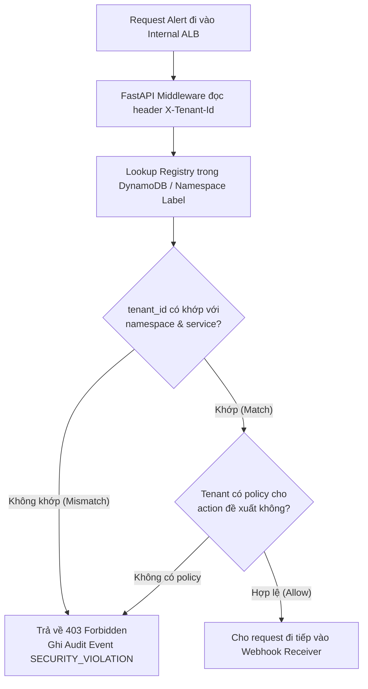
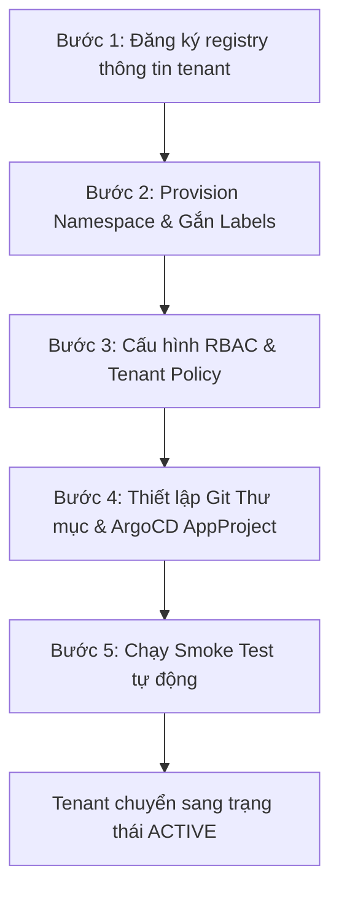

# Infrastructure Design - Task force 3 · CDO 1

<!-- Doc owner: <Nhóm CDO>
     Status: Draft (W11 T3-T4) → Final (W11 T6 Pack #1) → Updated (W12 T4 Pack #2)
     Word target: 1500-2500 từ
     Tier: Medium -->

## 1. Architecture diagram

<!-- Mermaid diagram thể hiện VPC layout, EKS cluster, subnets, data flow -->

*Caption: <giải thích flow + tại sao layout này>*

## 2. Component table

| Component | AWS Service | Reason | Cost note |
|---|---|---|---|
| Compute | | | $X |
| API entry | | | $X |
| Database | | | $X |
| Storage | | | $X |
| Event bus | | | $X |
| Observability | | | $X |

## 3. Differentiation angle deep-dive

### 3.1 Why this angle?

<!-- Tại sao chọn hướng tiếp cận này? Lý do chi tiết -->

### 3.2 Vượt trội ở đâu (số liệu)

| Axis | My number | Competing angle estimate |
|---|---|---|
| Cost / tenant / month | $X | $Y |
| P99 latency | Xms | Yms |
| Ops overhead (hr/week) | X | Y |
| Time to onboard tenant | X min | Y min |

### 3.3 Weakness chấp nhận

<!-- Honest về trade-off. Reviewer thích honesty hơn là "everything is great" -->

## 4. Multi-tenant approach

### 4.1. Mô hình định danh tenant

Trong hệ thống Self-Heal Platform, một tenant được định nghĩa là một khách hàng hoặc một team sở hữu một nhóm microservice chạy trên Kubernetes. 

Trong phạm vi capstone demo, hệ thống sẽ triển khai tối thiểu 2 tenant chạy song song nhằm chứng minh khả năng cách ly dữ liệu và phân quyền thực thi chặt chẽ:

| Tenant ID | Namespace | Service Demo | Subscription Tier |
| :--- | :--- | :--- | :--- |
| `tnt-payment-demo` | `tenant-payment` | `payment-api` | **Pro** |
| `tnt-checkout-demo` | `tenant-checkout` | `checkout-api` | **Basic** |

Mỗi tenant có một mã định danh duy nhất là `tenant_id`. Mọi request, alert signal, telemetry package, remediation action và audit log đều bắt buộc phải gắn kèm `tenant_id`. Nhờ đó, hệ thống luôn xác định chính xác ngữ cảnh: incident này thuộc về ai, policy nào cần được áp dụng, và giới hạn tài nguyên tương ứng là bao nhiêu.

#### Xác thực và Validate Tenant Context

Mọi alert gửi từ Prometheus Alertmanager vào Webhook Receiver đều phải đính kèm header:
```http
X-Tenant-Id: <tenant_id>
```

Tuy nhiên, hệ thống áp dụng nguyên tắc **Zero Trust** và không tin cậy header này một cách vô điều kiện. Trước khi bất kỳ alert nào được đưa vào xử lý, Webhook Receiver sẽ thực hiện validate ngữ cảnh thông qua FastAPI Middleware.



##### Ví dụ Request Không Hợp Lệ:
* **Header**: `X-Tenant-Id: tnt-payment-demo`
* **Target Namespace**: `tenant-checkout`

*Hành vi chặn request*: Do `tnt-payment-demo` không được phép thao tác trên namespace `tenant-checkout`, request sẽ lập tức bị chặn tại Middleware:

**Response (403 Forbidden)**:
```json
{
  "error": "TENANT_NAMESPACE_MISMATCH",
  "message": "Tenant is not allowed to operate on the requested namespace."
}
```

**Audit Log tương ứng (S3 Object Lock)**:
```json
{
  "event_type": "SECURITY_VIOLATION",
  "reason": "TENANT_NAMESPACE_MISMATCH",
  "tenant_id": "tnt-payment-demo",
  "requested_namespace": "tenant-checkout",
  "decision": "DENY"
}
```

#### Tầng Dịch Vụ (Subscription Tiers)

Hệ thống hỗ trợ 3 tier dịch vụ với các đặc quyền và giới hạn tài nguyên khác nhau:

| Tier | Mục đích | Đặc quyền & Giới hạn (Blast Radius) |
| :--- | :--- | :--- |
| **Basic** | Môi trường test, dev hoặc các dịch vụ không quan trọng | Quota thấp, cooldown duration lâu, ít tùy biến policy |
| **Pro** | Các microservice production thông thường | Quota trung bình, remediation tiêu chuẩn, hỗ trợ cấu hình cooldown ngắn hơn |
| **Enterprise** | Các dịch vụ lõi cực kỳ quan trọng | Quota cao, audit logs được kiểm soát chặt chẽ, custom policy linh hoạt |

---

### 4.2. Cách tách biệt dữ liệu và quyền giữa các tenant

Nhóm thiết kế quyết định chọn mô hình **Bridge Isolation** làm kiến trúc cốt lõi.

> [!IMPORTANT]
> **Bridge Isolation**: Toàn bộ hạ tầng dữ liệu (DynamoDB, SQS, S3) được dùng chung để tối ưu hóa chi phí vận hành và tài nguyên. Tuy nhiên, dữ liệu của mỗi tenant được phân vùng logic (partitioned) nghiêm ngặt bằng `tenant_id`. Ngược lại, quyền thực thi ở compute layer (Kubernetes, GitOps) được cách ly vật lý bằng Namespaces, RBAC, ArgoCD Applications và ArgoCD AppProjects.

#### So sánh các mô hình cách ly:

| Mô hình | Cơ chế hoạt động | Ưu điểm | Nhược điểm | Chọn |
| :--- | :--- | :--- | :--- | :---: |
| **Silo Isolation** | Mỗi tenant sở hữu database, queue, bucket và compute riêng biệt | Bảo mật tuyệt đối, không lo Noisy Neighbor | Chi phí hạ tầng cực lớn, quản lý phức tạp, không phù hợp cho sandbox | ❌ |
| **Pool Isolation** | Dùng chung toàn bộ hạ tầng từ compute tới database, chỉ lọc bằng tenant_id trong code | Chi phí rẻ nhất, triển khai cực nhanh | Rủi ro rò rỉ dữ liệu cao nếu logic filter trong code có lỗi | ❌ |
| **Bridge Isolation** | Dùng chung data layer (phân vùng bằng key) nhưng tách biệt compute layer (namespace/RBAC/GitOps) | Cân bằng hoàn hảo giữa chi phí tối ưu và tính an toàn bảo mật | Đòi hỏi kiểm tra tenant context và policy cực kỳ chặt chẽ |  |

---

#### 4.2.1. Data isolation

Mặc dù sử dụng chung các dịch vụ lưu trữ dữ liệu để tiết kiệm chi phí, hệ thống thực thi các cơ chế phân cách sau:

##### 1. DynamoDB (Incident State & Locks)
DynamoDB lưu trữ thông tin vòng đời sự cố, idempotency locks và registry. Dữ liệu được cách ly logic bằng cách thiết kế khóa chính (Primary Key) chứa tiền tố `tenant_id`:
* **Incident State Key**: `PK = <tenant_id>#<incident_id>`
  * *Ví dụ*: `tnt-payment-demo#inc-001`
* **Idempotency Lock Key**: `lock_key = <tenant_id>#<namespace>#<service>#<alert_name>#<action_type>`
  * *Ví dụ*: `tnt-payment-demo#tenant-payment#payment-api#CrashLoopBackOff#RESTART_DEPLOYMENT`

##### 2. S3 Audit Log (Immutable Logs)
Toàn bộ log kiểm toán sự cố được đẩy về một S3 Bucket chung, tuy nhiên mỗi tenant sẽ ghi log vào một folder prefix riêng biệt. Cấu trúc path được định nghĩa như sau:
```
s3://selfheal-audit/<tenant_id>/<yyyy>/<mm>/<dd>/<incident_id>.json
```
* *Ví dụ*: `s3://selfheal-audit/tnt-payment-demo/2026/06/23/inc-001.json`

Cơ chế này giúp tách biệt dữ liệu hoàn toàn, đồng thời cho phép Amazon Athena phân vùng dữ liệu (Partition Projection) theo `tenant_id` để tăng tốc độ truy vấn và kiểm toán.

##### 3. SQS (Event Broker Queue)
SQS queue dùng chung để giảm chi phí queue. Tuy nhiên, để đảm bảo tính cô lập:
* **Message Attributes**: Mọi message gửi vào SQS bắt buộc phải đính kèm metadata của tenant trong `MessageAttributes` (bao gồm `tenant_id`, `incident_id`, `severity`, `action_type`).
* **Message Body**: Chứa payload chi tiết để xử lý.

```json
// Ví dụ Message Attributes gửi vào SQS:
{
  "tenant_id": { "DataType": "String", "StringValue": "tnt-payment-demo" },
  "incident_id": { "DataType": "String", "StringValue": "inc-001" },
  "action_type": { "DataType": "String", "StringValue": "RESTART_DEPLOYMENT" }
}
```
*Lý do tách Message Attributes*: Giúp các Worker nhanh chóng kiểm tra quyền sở hữu và route message mà không cần deserialize toàn bộ payload body, đồng thời hỗ trợ debug trên Dead Letter Queue (DLQ) dễ dàng hơn.

---

#### 4.2.2. Execution isolation

Hệ thống có hai luồng xử lý sự cố (Dual Execution Path), do đó quyền thực thi được thiết kế cô lập cho từng luồng:

```mermaid
flowchart TD
    subgraph Direct Patch Path [Luồng Direct Patch (Khẩn cấp)]
        WebhookA[Webhook Receiver] --> GuardA[Policy Guardrail]
        GuardA --> EngineA[Direct Patch Engine]
        EngineA -->|K8s API Patch| K8s[Kubernetes API]
        K8s --> RBAC{K8s Namespace RBAC}
        RBAC -- Hợp lệ --> Execute[Execute Action]
        RBAC -- Không hợp lệ --> Block[Block & Audit]
    end

    subgraph GitOps Path [Luồng GitOps (Thông thường)]
        WebhookB[Webhook Receiver] --> Workflow[Argo Workflows]
        Workflow --> CommitEngine[Git Commit Engine]
        CommitEngine -->|Commit manifests| GitRepo[GitHub GitOps Repo]
        GitRepo --> ArgoCD[ArgoCD Sync]
        ArgoCD --> AppProj{ArgoCD AppProject
Destinations Limit}
        AppProj -- Đúng Namespace --> Apply[Sync Workload]
        AppProj -- Sai Namespace --> Reject[Reject Sync & Alert]
    end
```

##### 1. Path 1: Direct Patch path (Xử lý nóng khẩn cấp)
Direct Patch Engine chạy cùng Pod với Webhook Receiver trong namespace `self-heal-system` và sử dụng `load_incluster_config()`. 

Để tránh việc Engine lạm dụng quyền hạn hoặc vô tình can thiệp chéo sang tenant khác, hệ thống không cấp quyền Cluster-wide. Thay vào đó, ServiceAccount thực thi được phân quyền cục bộ bằng **RoleBinding** tại từng namespace của tenant:
* **ServiceAccount**: `selfheal-executor` (nằm tại namespace `self-heal-system`)
* **RoleBinding (tại namespace `tenant-payment`)**: Liên kết `selfheal-executor` với Role `patch-deployments`.
* **RoleBinding (tại namespace `tenant-checkout`)**: Liên kết `selfheal-executor` với Role `patch-deployments`.

**Bảng phân quyền thực thi của Direct Patch Engine:**

| Quyền được phép (Allowed) | Quyền bị chặn hoàn toàn (Blocked) |
| :--- | :--- |
| `get`/`list`/`watch` Pods, Events, Deployments trong namespace của tenant | Truy cập namespace hệ thống (`kube-system`, `argocd`, `self-heal-system`) |
| `patch` Deployment & StatefulSet trong namespace được bind | Xóa Namespace (`delete namespace`) |
| `restart` Workload trong namespace của tenant | Sửa đổi hoặc tạo mới `ClusterRole` / `ClusterRoleBinding` |
| | Tác động sang namespace của tenant khác |

##### 2. Path 2: GitOps path (Thay đổi lâu dài / Auto-scaling)
Để tránh cấu hình sai hoặc tấn công leo thang đặc quyền qua GitOps, cấu trúc Git và ArgoCD được thiết kế độc lập hoàn toàn:

* **Phân vùng cấu trúc thư mục Git**:
  ```bash
  gitops-state/
  └── tenants/
      ├── tnt-payment-demo/
      │   └── manifests/
      └── tnt-checkout-demo/
          └── manifests/
  ```
* **ArgoCD Application riêng biệt**: Mỗi tenant sở hữu một thực thể ArgoCD Application riêng (`selfheal-tnt-payment-demo`, `selfheal-tnt-checkout-demo`).
* **ArgoCD AppProject**: Để triệt tiêu rủi ro ArgoCD sync nhầm manifest của tenant này sang namespace tenant khác, mỗi tenant được gắn với một `AppProject` quy định cứng target namespace.

*Ví dụ cấu hình AppProject cho `tnt-payment-demo`:*
```yaml
apiVersion: argoproj.io/v1alpha1
kind: AppProject
metadata:
  name: selfheal-payment
  namespace: argocd
spec:
  sourceRepos:
    - https://github.com/my-org/gitops-state.git
  destinations:
    - namespace: tenant-payment
      server: https://kubernetes.default.svc
```
> [!TIP]
> Nhờ cấu hình `destinations` giới hạn cứng tại AppProject, ngay cả khi Git Commit Engine commit nhầm manifest của `tnt-payment-demo` với target namespace là `tenant-checkout`, ArgoCD sẽ lập tức từ chối đồng bộ (Out-of-Sync/Permission Denied) ở mức độ hạ tầng.

---

### 4.3. Quy trình thêm tenant mới (Onboarding Flow)

Khi có một tenant mới tham gia hệ thống Self-Heal Platform, quy trình onboarding tự động gồm 5 bước sau sẽ được kích hoạt để đảm bảo tính nhất quán và an toàn:



#### Chi tiết các bước onboarding:

##### Bước 1: Đăng ký thông tin Tenant (Register Registry)
Platform Admin đăng ký thông tin tenant vào DynamoDB registry table `tenant_registry`:
```json
{
  "tenant_id": "tnt-payment-demo",
  "tenant_name": "Payment Service Team",
  "tier": "pro",
  "namespace": "tenant-payment",
  "status": "PENDING"
}
```

##### Bước 2: Tạo Kubernetes Namespace và Labels
Terraform hoặc GitOps Controller provision namespace cho tenant với các labels quy chuẩn:
```yaml
apiVersion: v1
kind: Namespace
metadata:
  name: tenant-payment
  labels:
    tenant_id: tnt-payment-demo
    tier: pro
    selfheal/enabled: "true"
```
*Các labels này giúp hệ thống tự động filter, validate request và áp dụng policy tương ứng.*

##### Bước 3: Tạo RBAC và Tenant Policy
Tạo Role, RoleBinding cho remediation executor (`selfheal-executor`) tại namespace mới và định nghĩa policy giới hạn trong registry:
```yaml
tenant_id: tnt-payment-demo
namespace: tenant-payment
allowed_actions:
  - RESTART_DEPLOYMENT
  - SCALE_UP_PODS
blocked_actions:
  - DELETE_NAMESPACE
  - ACCESS_KUBE_SYSTEM
limits:
  max_scale_multiplier: 2
  cooldown_minutes: 5
```

##### Bước 4: Tạo thư mục Git và ArgoCD AppProject
* Tạo thư mục `gitops-state/tenants/tnt-payment-demo/`.
* Khởi tạo ArgoCD `AppProject` giới hạn quyền deploy chỉ trong namespace `tenant-payment`.
* Khởi tạo ArgoCD `Application` liên kết thư mục Git với namespace tương ứng.

##### Bước 5: Chạy Smoke Test tự động
Trước khi chuyển trạng thái sang `ACTIVE`, hệ thống kích hoạt bộ smoke test tự động để xác minh:
1. Gửi alert giả lập đúng `tenant_id` và `namespace` $
ightarrow$ Expect: `ACCEPTED` (202).
2. Gửi alert giả lập sai `namespace` $
ightarrow$ Expect: `403 TENANT_NAMESPACE_MISMATCH`.
3. Yêu cầu restart workload trong namespace tenant $
ightarrow$ Expect: `ALLOWED` và thực thi thành công.
4. Yêu cầu restart workload sang namespace tenant khác $
ightarrow$ Expect: `DENIED` từ RBAC.
5. Kiểm tra audit log được ghi nhận đúng prefix trên S3 bucket.

*Chỉ khi 5 smoke test trên pass hoàn toàn, trạng thái tenant trong DynamoDB mới được chuyển thành `ACTIVE`.*

---

### 4.4. Chống một tenant chiếm hết tài nguyên (Noisy Neighbor Mitigation)

Trong mô hình multi-tenant dùng chung tài nguyên hạ tầng, hiện tượng **Noisy Neighbor** (một tenant gặp sự cố liên tục phát sinh hàng ngàn alert spam làm nghẽn hệ thống, khiến alert của các tenant khác bị chậm trễ) là cực kỳ nguy hiểm. 

Để giải quyết triệt để vấn đề này, Self-Heal Platform triển khai **5 cơ chế phòng vệ** độc lập:

```
[Request Alert] 
      │
      ├──> (1) Rate Limiting (FastAPI Middleware + DynamoDB Token Bucket)
      │
      ├──> (2) Idempotency Lock & Cooldown (DynamoDB Conditional Write)
      │
      ├──> (3) Concurrency Limit (asyncio Semaphores & Argo CD Workflow Limits)
      │
      ├──> (4) ResourceQuota & LimitRange (Kubernetes Namespace Hard Limits)
      │
      └──> (5) Blast-Radius Controls (Action Block Policy)
```

---

#### 4.4.1. Per-tenant rate limit

Hệ thống quy định quota số sự cố (incident) tối đa được xử lý trong mỗi phút dựa trên tier của tenant:

| Tier | Incident/Phút | Concurrent Remediation | Cooldown Duration |
| :--- | :---: | :---: | :---: |
| **Basic** | 10 | 2 | 10 phút |
| **Pro** | 30 | 5 | 5 phút |
| **Enterprise** | 60 | 10 | 2 phút |

Do Webhook Receiver tiếp nhận request trực tiếp từ Internal ALB (không qua API Gateway), cơ chế rate limit được viết trực tiếp tại FastAPI Middleware sử dụng thuật toán **DynamoDB Token Bucket**:
* **Table**: `tenant_rate_limits`
* **Schema**: `PK = tenant_id`, `SK = window_timestamp` (lưu count, quota, ttl).

##### Luồng xử lý Rate Limit:
FastAPI Middleware tăng biến đếm counter trong DynamoDB ứng với window 60s hiện tại. Nếu vượt quá quota cho phép của tier, request bị từ chối ngay lập tức:
* **HTTP Response**: `429 Too Many Requests` (Header: `Retry-After: 30`)
* **Audit Event**:
  ```json
  {
    "event_type": "RATE_LIMITED",
    "tenant_id": "tnt-checkout-demo",
    "tier": "basic",
    "quota": "10 incidents/minute",
    "decision": "DENY"
  }
  ```

---

#### 4.4.2. Idempotency lock và cooldown

Để ngăn chặn việc Alertmanager liên tục gửi các cảnh báo trùng lặp (ví dụ: pod bị CrashLoopBackOff liên tục) dẫn đến việc platform thực hiện restart workload lặp đi lặp lại vô ích, hệ thống áp dụng **Idempotency Lock** qua DynamoDB Conditional Write.

* Khóa Lock được thiết lập dựa trên: `tenant_id#namespace#service#alert_name#action_type`
* Khi nhận alert, hệ thống cố gắng tạo lock ghi nhận thời gian bắt đầu.
* Nếu lock đã tồn tại và cooldown window chưa kết thúc, hành động tự vá lỗi mới cho alert đó sẽ bị bỏ qua và đánh dấu trạng thái là `SUPPRESSED_DUPLICATE`.

**Audit log cho sự kiện bị duplicate:**
```json
{
  "event_type": "SUPPRESSED_DUPLICATE",
  "tenant_id": "tnt-payment-demo",
  "service": "payment-api",
  "action_type": "RESTART_DEPLOYMENT",
  "reason": "Existing cooldown lock is still active."
}
```

---

#### 4.4.3. Per-tenant concurrency limit

Hệ thống giới hạn số lượng tiến trình vá lỗi đang chạy đồng thời (in-flight remediation) của mỗi tenant để tránh quá tải cho Kubernetes API và AI Engine:
* **Direct Patch path**: FastAPI Webhook Receiver quản lý thông qua process-level `asyncio.Semaphore` dựa trên tier (Basic: 2, Pro: 5, Enterprise: 10).
* **GitOps path**: Sử dụng cơ chế semaphore cấp độ workflow của Argo Workflows để cấu hình số lượng workflow chạy đồng thời tối đa của từng tenant.

If vượt quá giới hạn concurrent, incident mới sẽ được đưa vào hàng đợi hoặc đánh dấu `TENANT_CONCURRENCY_LIMITED` kèm theo audit event:
```json
{
  "event_type": "TENANT_CONCURRENCY_LIMITED",
  "tenant_id": "tnt-payment-demo",
  "limit": 5,
  "decision": "DELAY"
}
```

---

#### 4.4.4. ResourceQuota trong namespace

Mỗi tenant được giới hạn tài nguyên tính toán nghiêm ngặt ở mức Kubernetes namespace để bảo vệ cluster không bị cạn kiệt tài nguyên (CPU, Memory, Pod count).

*Ví dụ cấu hình ResourceQuota cho namespace `tenant-payment`:*
```yaml
apiVersion: v1
kind: ResourceQuota
metadata:
  name: tenant-payment-quota
  namespace: tenant-payment
spec:
  hard:
    requests.cpu: "4"
    requests.memory: 8Gi
    limits.cpu: "8"
    limits.memory: 16Gi
    pods: "40"
```
> [!IMPORTANT]
> Nhờ ResourceQuota, ngay cả khi AI Engine đưa ra hành động scale up quá mức do lỗi logic, Kubernetes Scheduler sẽ từ chối tạo thêm Pod mới nếu vượt ngưỡng cứng 40 Pods, đảm bảo blast radius luôn được kiểm soát trong phạm vi của tenant đó mà không gây ảnh hưởng đến các node dùng chung của cluster.

---

#### 4.4.5. Blast-radius policy theo action

Mỗi đề xuất tự vá lỗi từ AI Engine đều phải đi qua bộ lọc **Policy Guardrail** để phân loại mức độ rủi ro và giới hạn ảnh hưởng:

| Action (Remediation) | Blast-Radius Control (Giới hạn hành vi) |
| :--- | :--- |
| `RESTART_DEPLOYMENT` | Chỉ được phép restart deployment thuộc đúng namespace của tenant |
| `SCALE_UP_PODS` | Giới hạn tối đa không tăng quá 2 lần số lượng replicas hiện tại |
| `ADJUST_MEMORY_LIMIT` | Giới hạn tăng tối đa 50% cấu hình memory limit hiện tại mỗi lần |
| `ROLLBACK_DEPLOYMENT` | Chỉ được phép rollback về phiên bản stable gần nhất |
| *Unknown Action* | Bị block lập tức và chuyển tiếp escalate cho quản trị viên |
| *Tác động kube-system* | Bị cấm tuyệt đối |

* Nếu một hành động vi phạm policy, incident sẽ chuyển sang trạng thái `BLOCKED_BY_POLICY`.
* Nếu tự vá lỗi thất bại liên tiếp hoặc không vượt qua bước verify, incident được đánh dấu `ESCALATED` và đẩy thông báo khẩn cấp qua Slack/PagerDuty.

**Ví dụ Audit Event khi Action bị Block:**
```json
{
  "event_type": "BLOCKED_BY_POLICY",
  "tenant_id": "tnt-payment-demo",
  "service": "payment-api",
  "action_type": "SCALE_UP_PODS",
  "reason": "Requested scale exceeds max_scale_multiplier=2",
  "decision": "DENY"
}
```

---

### Tóm tắt thiết kế

Nhóm thiết kế CDO-1 thống nhất áp dụng mô hình **Bridge Isolation** vì nó phản ánh chính xác cấu trúc hạ tầng đã chọn:
* Tối ưu chi phí bằng cách dùng chung Data layer (phân vùng logic qua `tenant_id` trong DynamoDB, prefix trong S3, attributes trong SQS).
* Đảm bảo an toàn vận hành bằng cách cô lập hoàn toàn Compute/Execution layer (dùng Kubernetes Namespace, K8s RBAC bindings, ArgoCD AppProjects và API Gateway / Process Semaphores).

Thiết kế này vừa đáp ứng đầy đủ yêu cầu khắt khe về bảo mật dữ liệu khách hàng vừa giữ chi phí sandbox trong mức tối thiểu, đồng thời khả thi để demo trọn vẹn trong thời gian 2 tuần của Capstone project.

# 5. Alternatives Considered & Infrastructure Components

Tài liệu này phân tích các giải pháp thay thế kỹ thuật đối với từng cấu phần (service) trong hệ thống tự chữa lành thuộc dự án Capstone, đồng thời biện luận dựa trên quy mô thực tế của doanh nghiệp SaaS B2B lớn (200+ microservices, lưu trữ 12TB dữ liệu với traffic biến động cao từ 120 khách hàng doanh nghiệp).

## 5.1 Compute Layer (EKS Compute Provisioning)

* **Option A — EKS Fargate Profile:**
    * *Pros:* Mô hình Serverless hoàn toàn cho Kubernetes, loại bỏ hoàn toàn công sức vận hành, vá lỗi và quản lý EC2 node phía dưới.
    * *Cons:* Gặp **technical blocker thực sự**: Fargate không hỗ trợ triển khai `DaemonSet`. Trong khi đó, hệ thống giám sát bắt buộc phải chạy ADOT/OTel Collector dưới dạng `DaemonSet` mức node để thu thập chỉ số hạ tầng theo deployment-contract. Ngoài ra, cấu phần `ArgoCD repo-server` cần một writable local filesystem ổn định, điều thường xuyên gây friction (xung đột/lỗi gán ổ đĩa) trên Fargate. Xét góc nhìn SaaS lớn, việc chạy Fargate sẽ khiến chi phí tích lũy theo từng Pod lẻ nhảy vọt lên mức khổng lồ, không có khả năng tối ưu hóa chia sẻ tài nguyên.
    * *Estimated Cost:* ~$120–180/tháng cho workload tương đương sandbox.
* **Option B — EKS Managed Node Group + Karpenter:**
    * *Pros:* Node provisioning thông minh, tự động phân tích nhu cầu của Pod để cấp phát các node EC2 với size tối ưu nhất (bin-packing), giúp tiết kiệm chi phí biên cực tốt cho môi trường Production dài hạn.
    * *Cons:* Độ dốc học tập (learning curve) cao, tốn nhiều thời gian cấu hình và kiểm thử vận hành lớn, tạo ra rủi ro trễ hạn đối với timeline 2 tuần của dự án Capstone.
    * *Estimated Cost:* ~$90–120/tháng.
* **Option C — EKS Managed Node Group + Cluster Autoscaler:**
    * *Pros:* Công nghệ mature và phổ biến, tài liệu module EKS và Terraform module hoạt động cực kỳ ổn định. Hỗ trợ đầy đủ và native cho các `DaemonSet` mức node. Cho phép **Resource Pooling** (gom nhiều microservices nhỏ vào chung các node EC2 lớn m5.large để tối ưu hóa hiệu năng phần cứng và tiết kiệm chi phí nền).
    * *Cons:* Tốc độ scale node chậm hơn Karpenter (phải chờ AWS ASG kích hoạt) và khả năng bin-packing chưa tối ưu bằng Karpenter ở quy mô siêu lớn.
    * *Estimated Cost:* ~$96–110/tháng (02 node m5.large chạy 24/7 trong 2 tuần demo + phí EKS Control Plane).

✅ **Chosen:** Option C — EKS Managed Node Group + Cluster Autoscaler
* **Reason:** Đáp ứng đầy đủ technical constraint của ADOT DaemonSet, triển khai nhanh bằng Terraform, phù hợp ngân sách sandbox và bảo toàn năng lực gom cụm tài nguyên cho 200+ microservices của SaaS lớn. Phương án Karpenter được ghi nhận và đẩy vào "production roadmap" trong tương lai.

## 5.2 State & Idempotency Database

* **Option A — Amazon ElastiCache Redis:**
    * *Pros:* Tốc độ phản hồi cực nhanh (in-memory latency < 1ms), hỗ trợ cơ chế thiết lập TTL native để tự động xóa khóa phân tán rất tiện lợi.
    * *Cons:* Phải duy trì cụm node chạy liên tục 24/7 (phát sinh chi phí cố định ngay cả khi hệ thống hoàn toàn idle), tăng tải vận hành (ops overhead). Với bài toán SaaS lớn chạm mốc 12TB dữ liệu, việc lưu trữ lượng lớn trạng thái transaction trên RAM của Redis sẽ đẩy chi phí hạ tầng tăng lên theo cấp số nhân.
    * *Estimated Cost:* ~$15–30/tháng.
* **Option B — DynamoDB On-Demand + Conditional Write:**
    * *Pros:* Cơ chế tính phí Pay-per-request giúp tối ưu hóa chi phí về $0 khi không có traffic (idle). Tính năng `conditional write` giải quyết trực tiếp yêu cầu làm Idempotency Lock Store chống xử lý trùng lặp alert. Khả năng scale-out vô hạn về cả dung lượng và throughput, hoàn toàn đáp ứng nhu cầu tăng trưởng dữ liệu 12TB của doanh nghiệp SaaS lớn. Đồng bộ pattern xử lý dữ liệu với AI team.
    * *Cons:* Latency cao hơn Redis vài mili-giây do truy xuất qua tầng HTTPS API và phải thiết kế cấu trúc Partition Key cẩn thận từ đầu.
    * *Estimated Cost:* ~$0–5/tháng (traffic sandbox nằm hoàn toàn trong Free Tier).

✅ **Chosen:** Option B — DynamoDB On-Demand
* **Reason:** Tối ưu chi phí sandbox về mức tối thiểu, đồng thời vẫn chứng minh được khả năng scale vượt trội cho bài toán SaaS lớn. Cơ chế conditional-write giải quyết triệt để yêu cầu chống xử lý trùng lặp lệnh khi xảy ra bão alert.

## 5.3 Webhook Receiver (Entry Layer)

* **Option A — AWS API Gateway + Lambda:**
    * *Pros:* Fully managed bởi AWS, tự động scale theo traffic, mô hình chi phí pay-per-use tối ưu.
    * *Cons:* Làm phức tạp hóa ranh giới bảo mật không cần thiết. Buộc phải thiết lập thêm một chuỗi kết nối phức tạp (`IAM ↔ K8s credential bridge`) để Lambda từ ngoài gọi ngược vào EKS API Server, làm mở rộng ranh giới bảo mật (Trust Boundary).
    * *Estimated Cost:* ~$0–10/tháng.
* **Option B — FastAPI Deployment trên EKS cụm nội bộ:**
    * *Pros:* Nằm trọn vẹn trong cùng một Trust Boundary bảo mật với hệ thống tự chữa lành (namespace `self-heal-system`). Sử dụng trực tiếp ServiceAccount nội bộ cụm thông qua hàm `load_incluster_config()`, loại bỏ hoàn toàn việc expose IAM credential ra ngoài. Đồng bộ stack code FastAPI với nhóm AI.
    * *Cons:* Phải tự quản lý manifest deployment và chạy liên tục trên cluster.
    * *Estimated Cost:* $0 thêm (Tận dụng không gian Compute Headroom của EKS Node Group có sẵn ở mục 5.1).

✅ **Chosen:** Option B — FastAPI Deployment
* **Reason:** Đơn giản hóa kiến trúc bảo mật, loại bỏ hoàn toàn cơ chế credential bridging phức tạp và tận dụng tối đa hạ tầng EKS sẵn có.
  
## 5.4 Orchestrator (GitOps Path)

* **Option A — AWS Step Functions + Lambda:**
    * *Pros:* Trạng thái xử lý (state machine), cơ chế retry và timeout được build-in sẵn. Quản lý luồng trực quan trực tiếp trên AWS Console UI, chi phí pay-per-use lý tưởng.
    * *Cons:* Bộ điều phối nằm ngoài cluster, làm tăng độ phức tạp khi phân quyền chéo. Bản chất luồng GitOps xử lý lỗi Loại 2 không cần chạm trực tiếp vào EKS API mà đi qua Git repository, nên việc đưa state machine ra ngoài không mang lại lợi ích bảo mật nào thực tế.
    * *Estimated Cost:* ~$0–5/tháng.
* **Option B — Argo Workflows (Self-hosted trên K8s):**
    * *Pros:* Native Kubernetes CRD chạy ngay trong cụm, hỗ trợ xử lý luồng phức tạp dạng DAG và retry container mạnh mẽ. Giao diện UI hiển thị real-time đồng bộ trong hệ sinh thái K8s giúp demo trực quan hơn. Đội dự án đã de-risked rủi ro nhân sự khi có 01 thành viên chủ chốt có kinh nghiệm vận hành thực tế.
    * *Cons:* Phải quản lý các CRD nội bộ trong cụm K8s.
    * *Estimated Cost:* $0 thêm (Compute overhead chạy trực tiếp trên EKS Node Group sẵn có, chi phí đã được gộp trọn gói vào mục 5.1).

✅ **Chosen:** Option B — Argo Workflows
* **Reason:** Toàn bộ bộ não điều phối nằm trong cùng một Trust Boundary bảo mật với ArgoCD và Direct Patch Engine, giúp giảm độ phức tạp vận hành và tăng tính đồng bộ, thuyết phục khi demo thực tế.

## 5.5 Direct Patch Engine — Loại 1 (Khẩn Cấp / Out-of-Band)

* **Option A — AWS Lambda gọi vào EKS API:**
    * *Pros:* Tách biệt hoàn toàn khỏi lifecycle của cụm K8s, khả năng tự động scale-out độc lập khi gặp bão alert sự cố.
    * *Cons:* Tốn thêm network hop từ ngoài vào mạng nội bộ cụm EKS, cần cấu hình phân quyền IRSA phức tạp và làm tăng độ trễ (latency) xử lý hành động khẩn cấp.
    * *Estimated Cost:* ~$0–5/tháng.
* **Option B — Python kubernetes-client chạy In-Process:**
    * *Pros:* Thực hiện same-cluster API call (gọi trực tiếp trong cụm), mang lại latency thực thi cực thấp nhằm đáp ứng cam kết mốc thời gian phản hồi hành động chữa lành khẩn cấp dưới 15 giây. Triển khai cực kỳ đơn giản.
    * *Cons:* Gắn chặt vào lifecycle của Webhook Receiver pod, không thể bóc tách để scale độc lập cấu phần.
    * *Estimated Cost:* $0 thêm (Chạy chung pod với Webhook Receiver).

✅ **Chosen:** Option B — Python kubernetes-client
* **Reason:** Ưu tiên tối thượng cho tốc độ phản hồi cực thấp để xử lý các sự cố khẩn cấp (như Pod bị OOMKilled hoặc Service stuck) ở quy mô môi trường sandbox.

## 5.6 Event Queue (Telemetry Pipeline)

* **Option A — SQS FIFO (First-In-First-Out):**
    * *Pros:* Đảm bảo thứ tự tin nhắn tuyệt đối (ordering guarantee) và hỗ trợ chống trùng lặp dữ liệu ở mức hạ tầng Cloud.
    * *Cons:* Throughput bị giới hạn nghiêm ngặt (300 - 3000 msg/s), không cần thiết khi hệ thống đã được thiết kế phòng vệ nhiều lớp ở tầng trên.
    * *Estimated Cost:* ~$0–2/tháng.
* **Option B — SQS Standard Queue:**
    * *Pros:* Thống số throughput gần như không giới hạn, chi phí tiệm cận mức $0, dễ dàng cấu hình bằng Terraform và đáp ứng hoàn hảo kịch bản bão alert (alert storm) của hệ thống SaaS gồm 200+ dịch vụ nhỏ.
    * *Cons:* Chấp nhận rủi ro nhỏ về at-least-once delivery (có thể phân phát lặp lại tin nhắn trong điều kiện mạng lỗi).
    * *Estimated Cost:* ~$0–2/tháng (nằm trong hạn mức 1 triệu request Free Tier của AWS).

✅ **Chosen:** Option B — SQS Standard
* **Reason:** Rủi ro trùng lặp hay sai thứ tự đã được xử lý triệt để bởi lớp ứng dụng nhờ sự kết hợp giữa `Idempotency-Key` và `DynamoDB conditional write`, do đó sử dụng SQS Standard là phương án tối ưu nhất về mặt kiến trúc phần cứng.


## 5.7 Audit Query Layer

* **Option A — OpenSearch Cluster / CloudWatch Logs Insights:**
    * *Pros:* Khả năng tìm kiếm text nâng cao mạnh mẽ, hỗ trợ dựng các hệ thống dashboard và analytics thời gian thực cho đội ngũ vận hành.
    * *Cons:* Chi phí duy trì cụm instance OpenSearch cực cao, tốn nhiều công sức vận hành hạ tầng nền và hoàn toàn vượt biên ngân sách $200 của sandbox. Không hỗ trợ native việc lưu trữ cô lập dạng dữ liệu bất biến chống sửa xóa theo yêu cầu compliance bằng S3 Object Lock.
    * *Estimated Cost:* ~$30–100+/tháng.
* **Option B — Amazon Athena (Serverless SQL):**
    * *Pros:* Kiến trúc Serverless hoàn toàn, mô hình tính phí pay-per-query (chỉ tính tiền dựa trên lượng dữ liệu quét qua lúc demo thực tế). Cho phép dùng cú pháp SQL tiêu chuẩn để truy vấn trực tiếp trên các file log tĩnh được lưu trữ nghiêm ngặt tại S3. 
    * *Cons:* Tốc độ truy vấn chậm hơn OpenSearch đối với các tác vụ tìm kiếm tương tác thời gian thực liên tục (interactive search).
    * *Estimated Cost:* ~$1–5/tháng (chỉ tốn vài cent cho vài chục câu lệnh demo lúc chấm pitch).

✅ **Chosen:** Option B — Athena
* **Reason:** Đáp ứng xuất sắc yêu cầu bài toán audit trail với chi phí thấp và không mất công vận hành cluster riêng. Đặc biệt, Athena cho phép truy vấn trực tiếp trên S3 đã kích hoạt cấu hình **S3 Object Lock (Compliance Mode)** khóa cứng dữ liệu trong 90 ngày, đảm bảo tính bất biến tuyệt đối của dữ liệu log chống sửa xóa (*tamper-evident*) theo đúng luật đề bài.


## 5.8 Observability Layer

* **Option A — Self-hosted kube-prometheus-stack:**
    * *Pros:* Miễn phí hoàn toàn về mặt bản quyền service, toàn quyền kiểm soát cấu hình metrics hệ thống.
    * *Cons:* Đội thêm quá nhiều công việc vận hành hạ tầng cho team trong vòng 2 tuần (phải tự size dung lượng lưu trữ ổ đĩa PVC, tự cấu hình cụm tính sẵn sàng cao HA cho Prometheus, tự quản lý chính sách nén dữ liệu).
    * *Estimated Cost:* ~$20–50/tháng cho phần compute + storage gán thêm.
* **Option B — Amazon Managed Prometheus (AMP) + Amazon Managed Grafana (AMG):**
    * *Pros:* Mô hình managed hoàn toàn từ AWS. AWS chịu toàn bộ trách nhiệm về tính sẵn sàng cao (HA), khả năng lưu trữ (retention) và vá lỗi hệ thống. Tích hợp mượt mà và bảo mật với ADOT Collector chạy dạng `DaemonSet` mức node.
    * *Cons:* Chi phí dịch vụ tính riêng biệt trên hóa đơn AWS, phụ thuộc chặt chẽ vào hệ sinh thái managed của nhà cung cấp Cloud.
    * *Estimated Cost:* ~$10–20/tháng (tính theo lượng metric nạp vào và phí không gian workspace).

✅ **Chosen:** Option B — AMP + AMG
* **Reason:** Giảm tối đa khối lượng công việc vận hành hạ tầng (ops effort) trong thời gian ngắn ngủi 2 tuần, giải phóng 100% thời gian của các thành viên để tập trung hoàn thiện logic cốt lõi của Self-Heal Engine nhằm bàn giao sản phẩm đúng hạn kỳ Capstone.

## 6. Scaling strategy

- **Vertical**: <!-- CPU/memory bump triggers -->
- **Horizontal**: <!-- auto-scaling rules -->
- **Triggers**: <!-- target CPU 70% / request count / queue depth -->

## 7. Failure modes + recovery

| Failure | Detection | Recovery | RTO | RPO |
|---|---|---|---|---|
| Single task crash | ECS/K8s health check | Auto-restart | < 60s | 0 |
| AZ outage | CloudWatch alarm | Multi-AZ failover | < 5min | < 1min |
| DB primary fail | RDS event | Read replica promotion | < 5min | < 1min |
| Region outage | External monitor | Manual region switch | TBD | TBD |

## Related documents

- [`03_security_design.md`](03_security_design.md)
- [`04_deployment_design.md`](04_deployment_design.md)
- [`05_cost_analysis.md`](05_cost_analysis.md)
- [`08_adrs.md`](08_adrs.md)
