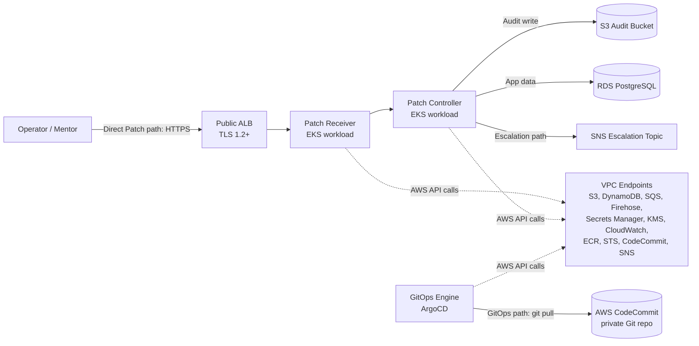

# Security Design - Task force 3 · CDO 1

<!-- Doc owner: <Nhóm CDO>
     Status: Draft (W11 T4) → Final (W11 T6) → Refined (W12 T4)
     Word target: 1200-2000 từ
     Scope: DevOps-level security (network, IAM, secrets, encryption, audit, K8s if applicable).
     Tier: Medium -->

## 1. Network Security

### 1.1 Network Diagram

Runtime traffic stays inside the CDO VPC. The design intentionally does not use a
NAT Gateway for runtime workloads; outbound access to AWS services is routed via
VPC Endpoints. GitOps reconciliation pulls manifests from AWS CodeCommit over a
private endpoint instead of GitHub.

Network boundaries:

- Public subnets host only the ALB and internet-facing routing components.
- Private application subnets host EKS managed nodes and Karpenter-provisioned
  nodes.
- Isolated data subnets host RDS.
- No workload requires direct internet egress during runtime reconciliation.
- Direct Patch path, GitOps path, and Escalation path are separated by security
  group rules and IAM permissions.

### 1.2 Security Groups

| SG name | Inbound | Outbound | Attached to |
|---|---|---|---|
| `sg-alb-public` | TCP 443 from approved operator CIDRs / WAF | TCP 8443 to `sg-eks-workload` | Public ALB |
| `sg-eks-workload` | TCP 8443 from `sg-alb-public`; pod-to-pod traffic allowed only through Kubernetes NetworkPolicy | TCP 443 to VPC endpoints; TCP 5432 to `sg-rds`; TCP 443 to EKS control plane | Patch Receiver, Patch Controller, Audit Writer, GitOps Engine |
| `sg-eks-control-plane` | TCP 443 from EKS nodes and authorized admin roles | TCP 10250 to EKS nodes; TCP 443 to AWS APIs via VPC endpoints | EKS control plane ENIs |
| `sg-rds` | TCP 5432 from `sg-eks-workload` only | No broad outbound; default AWS managed response traffic only | RDS PostgreSQL |
| `sg-vpc-endpoint` | TCP 443 from `sg-eks-workload` and `sg-eks-control-plane` | TCP 443 to AWS service endpoint targets | Interface VPC endpoints |

Rules are managed as Terraform state and reviewed through the same pull-request
path as application manifests. Broad CIDR-to-workload access is blocked; workload
access is expressed by SG references wherever possible.

### 1.3 Network ACL / VPC Endpoint

- Network ACLs stay stateless and conservative: public subnets allow ALB ingress
  on 443 plus ephemeral response ports; private and data subnets allow only VPC
  CIDR traffic required by EKS, RDS, and interface endpoint return traffic.
- Runtime GitOps uses AWS CodeCommit through VPC endpoints. GitHub is allowed in
  CI/CD bootstrap stages if required by deployment design, but not in runtime
  reconciliation.
- Gateway VPC Endpoints:
  - S3 for audit storage, ECR layer retrieval, Terraform state access if hosted
    in the account.
  - DynamoDB for lock tables and service integration where applicable.
- Interface VPC Endpoints:
  - SQS for asynchronous patch workflows.
  - Kinesis Firehose for audit delivery.
  - Secrets Manager for secret retrieval.
  - KMS for encrypt/decrypt calls.
  - CloudWatch Logs and CloudWatch Metrics for observability.
  - ECR API and ECR Docker for private image pulls.
  - STS for IRSA token exchange.
  - CodeCommit Git and CodeCommit API for ArgoCD Git pull.
  - SNS for escalation notifications.
- Endpoint policies deny unrelated repositories, buckets, topics, and keys. The
  S3 endpoint policy allows only required audit, artifact, and state buckets.

---

## 2. IAM & Access Control

### 2.1 Service Roles

| Role | Used by | Permissions (least-privilege) |
|---|---|---|
| `irsa-patch-receiver` | Receiver ServiceAccount | Read request configuration, write sanitized request metadata, no mutation permission on infrastructure resources |
| `irsa-patch-controller` | Controller ServiceAccount | Read approved patch intents, create bounded Kubernetes changes in owned namespaces, call STS, read required Secrets Manager entries |
| `irsa-audit-writer` | Audit Writer ServiceAccount | `firehose:PutRecord`, `firehose:PutRecordBatch`, scoped S3 write through Firehose delivery role, KMS encrypt for audit key |
| `irsa-gitops-engine` | ArgoCD / GitOps Engine ServiceAccount | `codecommit:GitPull` and read-only CodeCommit API access for the CDO repository only |
| `irsa-karpenter-controller` | Karpenter ServiceAccount | Provision and terminate allowed EC2 node classes, read SSM AMI parameters, pass only the approved EKS node instance profile |
| `eks-node-role` | EKS managed node groups and Karpenter nodes | ECR image pull, CloudWatch agent publishing, CNI permissions, no application data access |
| `irsa-escalation-notifier` | Escalation worker ServiceAccount | `sns:Publish` to the approved escalation topic only |
| `firehose-delivery-role` | Kinesis Firehose | Write to audit S3 bucket prefix, use audit KMS key, emit delivery errors to CloudWatch |

AI Engine ownership note: if AIOps owns the model runtime, CDO service roles do
not include `bedrock:InvokeModel`. CDO passes approved requests and receives
decisions through the agreed integration contract rather than invoking the model
directly.

### 2.2 K8s RBAC

| Role | Subject | Verbs | Resources | Namespace scope |
|---|---|---|---|---|
| `patch-receiver-readonly` | `sa/patch-receiver` | `get`, `list` | `configmaps`, `services`, `endpoints` | `cdo-system` |
| `patch-controller-ns-editor` | `sa/patch-controller` | `get`, `list`, `watch`, `patch`, `update` | `deployments`, `statefulsets`, `configmaps`, `horizontalpodautoscalers` | Tenant namespaces owned by CDO |
| `audit-writer-runtime` | `sa/audit-writer` | `create` | `events` | `cdo-system` |
| `argocd-application-sync` | `sa/argocd-application-controller` | `get`, `list`, `watch`, `patch`, `update`, `create` | Declared application resources only | Namespaces listed in the ArgoCD AppProject |
| `karpenter-controller` | `sa/karpenter` | `get`, `list`, `watch`, `create`, `delete` | `nodes`, `nodeclaims`, `nodepools`, `events` | Cluster-scoped where required by Karpenter |
| `escalation-notifier-readonly` | `sa/escalation-notifier` | `get`, `list` | `configmaps`, `events` | `cdo-system` |

RBAC rules do not grant `cluster-admin` to CDO workloads. Tenant mutation is
limited to namespaces explicitly assigned to CDO, and cross-tenant mutation is
blocked by namespace scoping, admission policy, and ArgoCD AppProject
destination restrictions.

### 2.3 Cross-account Access

If platform, AIOps, and CDO accounts are separated, cross-account access uses an
explicit assume-role pattern:

- The CDO workload role assumes only named target roles with external ID and
  session tags (`tenant_id`, `service`, `purpose`).
- Target account roles trust the CDO account OIDC provider or deployment role,
  not broad AWS principals.
- Session duration is short and aligned with reconciliation jobs.
- CloudTrail records `AssumeRole` and downstream actions in both source and
  target accounts.
- CDO roles cannot assume AIOps model-owner roles unless an ADR explicitly moves
  AI Engine ownership to CDO.

---

## 3. Secrets Management

### 3.1 Secrets Inventory

| Secret | Storage | Rotation | Accessed by |
|---|---|---|---|
| | | | |

### 3.2 Inject Pattern

<!-- ECS task definition? Kubernetes External Secrets Operator? Env var via Init container? -->

### 3.3 Anti-leak Controls

- Secrets KHÔNG commit Git.
- Container image không bake credential.
- Application log redact pattern.

---

## 4. Encryption

### 4.1 At Rest

| Data | Storage | KMS key | Notes |
|---|---|---|---|
| | | | |

### 4.2 In Transit

- ALB listener TLS setup.
- Internal service-to-service communication encryption.
- AWS services invocation encryption.

### 4.3 Key Management

- CMK rotation settings.
- Key policy.
- KMS audit.

---

## 5. Audit Logging

### 5.1 What to Log

<!-- AI engine decision fields, Infrastructure change tracking, K8s API mutation, app errors -->

### 5.2 Storage + Retention

| Log type | Storage | Retention | Query interface |
|---|---|---|---|
| | | | |

### 5.3 PII Handling (basic)

- Schema whitelist.
- Redaction at ingest.

---

## 6. Container & K8s Security (chỉ áp dụng nếu CDO chọn K8s/EKS angle)

- Image scan rules.
- Image signing.
- Pod Security Standard profiles.
- NetworkPolicies.
- IRSA (IAM Roles for Service Accounts).

---

## 7. Compliance Touchpoints

| Standard | Relevant controls (capstone scope) |
|---|---|
| SOC2 Type II | |
| GDPR | |

---

## 8. Open Questions

- [ ] Q1: ...
- [ ] Q2: ...

## Related documents

- `02_infra_design.md`
- `04_deployment_design.md`
- `08_adrs.md`
